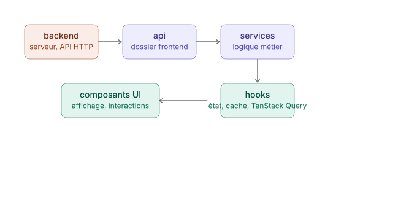
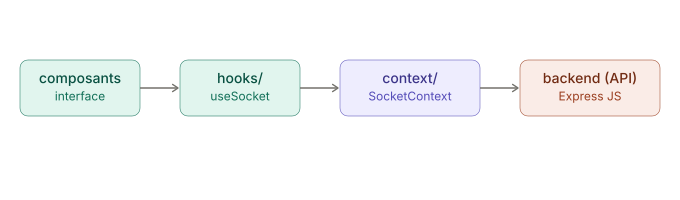
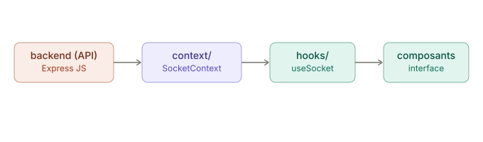

# Documentation technique : structure et architecture frontend

Ce document définit la structure du code, l'organisation des fichiers ainsi que les technologies clés utilisées pour le développement de la partie frontend de l'application.

## 1. Architecture des fichiers et dossiers (`src/`)

Le projet suit une structure modulaire garantissant la séparation des responsabilités et une scalabilité optimale.

```
src/
├── api/                # Fichiers d'appel d'API, un fichier par ressource (tâches simples)
├── assets/             # Ressources statiques (polices, images, illustrations)
├── components/         # Composants d'interface réutilisables
│   ├── ui/             # Composants atomiques de base (boutons, inputs - ex: Shadcn)
│   └── auth/           # Composants spécifiques à un module métier (ex: LoginCard)
├── config/             # Configuration globale de l'application (constantes)
├── context/            # Gestion de l'état global via React Context (ex: AuthContext, SocketContext)
├── hooks/              # Hooks personnalisés (ex: useAuth, useSocket)
├── layouts/            # Structures de mise en page de l'application (ex: AuthLayout, PlayerLayout)
├── modules/            # Modules réutilisables à travers l'application (ex: api.client.ts)
├── pages/              # Composants principaux représentant les vues / routes de l'application
├── routes/             # Configuration du routage et gestion des accès (AppRouter, ProtectedRoute)
├── services/           # Logique réseau et connecteurs d'API (instances Axios, instances de sockets)
├── styles/             # Styles globaux, thèmes et variables de configuration CSS
└── utils/              # Fonctions utilitaires et helpers (formatage de données, validateurs)
```

## 2. Stack technique et écosystème

L'application s'appuie sur un ensemble de bibliothèques modernes sélectionnées pour leurs performances, leur maintenabilité et leur interopérabilité.

| Bibliothèque / outil | Rôle / description | Statut |
| :--- | :--- | :--- |
| **React** | Bibliothèque principale pour la construction de l'interface utilisateur basée sur des composants. | Requis |
| **Tailwind CSS** | Framework CSS utilitaire pour un stylisage rapide, cohérent et responsive. | Requis |
| **Shadcn UI** | Collection de composants d'interface accessibles et personnalisables. | Facultatif |
| **lucide-react** | Bibliothèque d'icônes unifiée, moderne et optimisée pour l'ensemble de l'application. | Requis |
| **Framer Motion** | Bibliothèque d'animation pour fluidifier l'expérience utilisateur et gérer les transitions de pages. | Requis |
| **Three.js / React Three Fiber / Drei** | Moteur de rendu et outils d'intégration d'éléments 3D interactifs. | Facultatif |
| **Axios** | Client HTTP pour la gestion des requêtes asynchrones (REST API) vers le serveur backend. | Requis |
| **TanStack Query** *(React Query)* | Gestionnaire d'état asynchrone pour la mise en cache, la synchronisation et la mise à jour des données HTTP. | Requis |
| **Socket.io-client** | Client WebSocket permettant d'établir une communication bidirectionnelle en temps réel avec le serveur. | Requis |

## 3. Conventions de nommage

Le projet applique des règles de nommage strictes selon la nature du fichier, afin de standardiser la base de code et de faciliter la recherche.

| Type de fichier | Style de casse | Exemple | Règle / contexte |
| :--- | :--- | :--- | :--- |
| **Composants React** | `PascalCase` | `QuestionCard.tsx` | Appliqué à tous les composants d'interface et layouts. |
| **Hooks personnalisés** | `camelCase` (préfixe `use`) | `useAuth.ts` | Obligatoire pour respecter les règles des Hooks React. |
| **Autres fichiers** *(modules, utils, services, routes)* | `dot notation` (minuscules) | `user.service.ts`, `auth.route.ts` | Sépare l'entité métier de sa responsabilité technique. |

## 4. Stratégie de gestion réseau et flux de données

Le frontend sépare distinctement ses flux de données selon qu'il s'agit d'une requête HTTP classique ou d'une communication en temps réel par WebSocket, afin d'optimiser les performances.

### A. Flux de requêtes HTTP (REST via Axios & TanStack Query)

- **Axios** est utilisé pour toutes les requêtes ponctuelles et transactionnelles (ex: soumission de formulaires, authentification, téléchargement de fichiers). Les instances et intercepteurs d'API sont configurés dans le dossier `services/`.
- **TanStack Query** encapsule ces appels Axios. Il gère de manière autonome le cycle de vie des données : la mise en cache, le rafraîchissement en arrière-plan, ainsi que les états natifs de chargement (`isLoading`) et d'erreur (`error`).

Pour les requêtes traditionnelles (CRUD, authentification, actions ponctuelles), les données suivent un cheminement linéaire et prédictible du serveur jusqu'au composant :



#### Appels API

Le fichier `/src/modules/api.client.ts` fournit une structure commune qui gère les différents types de requêtes HTTP. Exemple d'utilisation dans un fichier du dossier `api/` :

```js
// Exemple de code dans : /api

import createClient from "../modules/api.client.js"; // import du module

export const LoginApi = () => {
  const client = createClient("login"); // crée le client sur l'endpoint /api/login

  return {
    submitLogin: (obj) => client.post("auth", obj), // envoie vers /api/login/auth
    anotherAction: (obj) => client.post("other", obj), // envoie vers /api/login/other
  };
};
```

### B. Flux temps réel (WebSockets via Socket.io-client)

Pour les fonctionnalités en temps réel (chat, notifications, synchronisation instantanée), la connexion est persistante et bidirectionnelle. Elle s'articule autour d'un Context React global qui centralise l'instance de connexion.

- La connexion au serveur WebSocket est centralisée via un **React Context** (`SocketContext`) à la racine de l'application, afin de garantir une instance unique.
- L'interaction avec le serveur s'effectue à travers des **hooks personnalisés** (ex: `useSocket`), qui écoutent les événements descendants du backend et émettent les actions du frontend.

**1. Émission (du composant vers le backend)**



**2. Réception (du backend vers le composant)**

